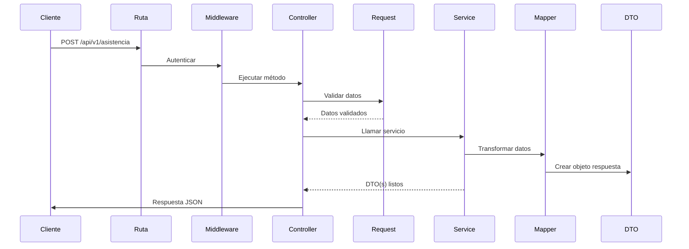

# 🏗️ Documentación de Arquitectura del Proyecto

**Versión:** 1.0.0  
**Arquitectura:** Monolito Modular con Domain-Driven Design (DDD)  
**Actualizado:** Mayo 2026  

---

## 📖 Tabla de Contenidos

1. [Visión General](#-visión-general)
2. [Principios de Diseño](#-principios-de-diseño)
3. [Estructura de Alto Nivel](#-estructura-de-alto-nivel)
4. [El Núcleo: `app/Core`](#-el-núcleo-appcore)
5. [Código Compartido: `app/Shared`](#-código-compartido-appshared)
6. [La Capa HTTP: `app/Http`](#-la-capa-http-apphttp)
7. [Modelos de Dominio: `app/Models`](#-modelos-de-dominio-appmodels)
8. [Módulos de Negocio: `app/Modules`](#-módulos-de-negocio-appmodules)
   - [🧑‍💼 Colaborador](#-colaborador)
   - [🏢 Gerencia](#-gerencia)
   - [👥 Líder de Área](#-líder-de-área)
   - [📊 Líder de División](#-líder-de-división)
   - [📋 Reclutamiento](#-reclutamiento)
   - [🔐 Login / Autenticación](#-login--autenticación)
   - [🌐 Otros Módulos](#-otros-módulos)
9. [Convenciones de Nombrado](#-convenciones-de-nombrado)
10. [Cómo Navegar el Código](#-cómo-navegar-el-código)
11. [Flujo de Trabajo de un Endpoint](#-flujo-de-trabajo-de-un-endpoint)
12. [Preguntas Frecuentes](#-preguntas-frecuentes)

---

## 🌟 Visión General

El proyecto sigue una **arquitectura de monolito modular basada en Domain-Driven Design (DDD)** . Esto significa que toda la aplicación vive en un solo repositorio, pero está organizada en módulos independientes que representan dominios de negocio reales.

**¿Por qué esta arquitectura?**

| Problema anterior | Solución actual |
|-------------------|-----------------|
| Carpetas planas con cientos de archivos mezclados | Módulos con contexto delimitado |
| Dependencias ocultas entre clases | Dependencias explícitas hacia `Core` y `Shared` |
| Difícil encontrar qué código afecta a qué funcionalidad | Cada dominio tiene sus propias capas |
| Imposible escalar el equipo | Varios desarrolladores pueden trabajar en módulos distintos sin conflictos |

---

## 🧠 Principios de Diseño

1. **Separación por Dominio**  
   Cada área funcional (Colaborador, Gerencia, Reclutamiento) es un módulo independiente.

2. **Capas Internas por Módulo**  
   - `Controllers` → Manejan peticiones HTTP  
   - `DTOs` → Transportan datos entre capas  
   - `Services` → Contienen la lógica de negocio  
   - `Mappers` → Transforman datos crudos a DTOs  
   - `Requests` → Validan datos de entrada  

3. **Dependencia hacia el Centro**  
   Los módulos dependen de `Core` y `Shared`, nunca entre ellos.

4. **Un Solo Modelo por Concepto**  
   Los modelos Eloquent (`app/Models`) representan las tablas de base de datos y se comparten.

---

## 📁 Estructura de Alto Nivel

```
raíz/
├── app/                    ← Código fuente principal
│   ├── Console/            ← Comandos Artisan
│   ├── Core/               ← Clases fundamentales del framework interno
│   ├── Http/               ← Capa HTTP genérica (middleware, kernel)
│   ├── Models/             ← Modelos Eloquent
│   ├── Shared/             ← Servicios y utilidades transversales
│   └── Modules/            ← Módulos de dominio
├── config/                 ← Archivos de configuración
├── database/               ← Migraciones, seeders, factories
├── routes/                 ← Definición de rutas
├── resources/              ← Vistas, assets, lang
├── storage/                ← Logs, cache, uploads
└── tests/                  ← Pruebas automatizadas
```

---

## 🔧 El Núcleo: `app/Core`

> 📌 **Propósito:** Contener todas las clases base, traits, enums y excepciones que dan forma al "framework interno".  
> ⚠️ **Regla:** Ningún módulo debe modificar estas clases sin coordinación del equipo.

```
app/Core/
├── DTO/
│   └── BaseValidDTO.php            ← Clase base para todos los DTOs
├── Traits/
│   ├── ApiResponse.php             ← Métodos helper para respuestas JSON
│   ├── DataGetter.php              ← Acceso seguro a arrays/objetos
│   └── ...
├── Enums/
│   ├── AssistStatus.php            ← Estados de asistencia
│   └── UserLevel.php               ← Niveles de usuario
├── Exceptions/
│   ├── BusinessRules/              ← Excepciones de lógica de negocio
│   └── InvalidDTO/                 ← Validación de DTOs
└── Providers/
    └── AppServiceProvider.php      ← Registro de servicios
```

---

## 🔄 Código Compartido: `app/Shared`

> 📌 **Propósito:** Servicios que no pertenecen a un dominio específico pero son usados por varios módulos.

```
app/Shared/
├── Services/
│   ├── AreaResolverService.php     ← Resuelve áreas/dependencias jerárquicas
│   ├── ImageStorageService.php     ← Almacenamiento de imágenes
│   └── PasswordResetService.php    ← Lógica de reseteo de contraseña
└── Mappers/
    └── ...                         ← Mapeadores transversales
```

---

## 🌐 La Capa HTTP: `app/Http`

> 📌 **Propósito:** Manejar middleware, kernel HTTP y controladores genéricos (no atados a un dominio).

```
app/Http/
├── Controllers/
│   ├── Controller.php              ← Clase base de controladores
│   └── web/LoginController.php     ← Controlador de login vía web
├── Kernel.php                      ← Kernel HTTP
├── Middleware/
│   ├── Authenticate.php
│   ├── RoleMiddleware.php
│   └── ...
└── Requests/
    ├── LoginRequest.php            ← Requests genéricos
    └── ...
```

---

## 📦 Modelos de Dominio: `app/Models`

> 📌 **Propósito:** Representar las tablas de la base de datos usando Eloquent.  
> 🔑 **Regla de oro:** Los modelos **no contienen lógica de negocio**. Solo relaciones, casts y scopes simples.

| Modelo | Tabla | Descripción |
|--------|-------|-------------|
| `User.php` | `users` | Usuarios del sistema |
| `Area.php` | `areas` | Áreas organizacionales |
| `Assist.php` | `assists` | Registros de asistencia |
| `Practitioner.php` | `practitioners` | Practicantes/postulantes |
| ... | ... | ... |

---

## 🧩 Módulos de Negocio: `app/Modules`

> 📌 **Propósito:** Cada módulo encapsula un dominio completo de la aplicación con su propio conjunto de controladores, DTOs, servicios, mapeadores y requests.

### Estructura Interna de un Módulo

```
Modules/NombreModulo/
├── Controllers/        ← Endpoints HTTP (uno por responsabilidad)
├── DTOs/               ← Objetos de transferencia de datos (inmutables)
│   └── Subdominio/     ← Agrupación opcional por subfuncionalidad
├── Services/           ← Toda la lógica de negocio
├── Mappers/            ← Transforman resultados DB → DTO
└── Requests/           ← Validación de datos de entrada
```

---

### 🧑‍💼 Colaborador

> **Dominio:** Dashboard personal del colaborador, asistencias, tiempos de conexión, tiempo hablado.

| Capa | Ejemplos |
|------|----------|
| **Controllers** | `V1AssistController`, `DashboardThColaboradorController` |
| **DTOs** | `CalendarCollaboratorDTO`, `KpiCollaboratorDTO`, `EvolutionDTO` |
| **Services** | `CalendarCollaboratorService`, `DashboardColaboradorConService` |
| **Mappers** | `DashboardColaboradorMapper` |
| **Requests** | `DashboardColaboradorRequest` |

---

### 🏢 Gerencia

> **Dominio:** Dashboards de gerencia con KPIs globales, gráficos y reportes.

| Capa | Ejemplos |
|------|----------|
| **Controllers** | `DashboardGerenciaControllerV3`, `DashboardthGerenciaControllerV1` |
| **DTOs** | `DashboardGerenciaDTO`, `GraficoBarrasGerenciaDto`, `Top5ConexionDTO` |
| **Services** | `DashboardGerenciaService`, `Top5ConexionService` |
| **Mappers** | `DashboardGerenciaMapper` |

---

### 👥 Líder de Área

> **Dominio:** KPIs y reportes para líderes de área, incluyendo ranking de colaboradores.

| Capa | Ejemplos |
|------|----------|
| **Controllers** | `DashboardLiderAreaControllerV3`, `DashboardThLiderAreaControllerV1` |
| **DTOs** | `DashboardLiderAreaDTO`, `VoiceKpiDTO`, `RankingConexionDTO` |
| **Services** | `DashboardLiderAreaService`, `VoiceCalendarService` |
| **Mappers** | `DashboardLiderAreaMapper` |

---

### 📊 Líder de División

> **Dominio:** Visión de división con comparativas, evoluciones y rankings.

| Capa | Ejemplos |
|------|----------|
| **Controllers** | `DashboardLiderDivisionControllerV3` |
| **DTOs** | `CollaboratorListLeaderDto`, `TimeTalkCalendarDTO` |
| **Services** | `CollaboratorListService`, `TimeTalkRankingService` |
| **Mappers** | `DashboardLiderDivisionMapper`, `DashboardLiderDivisionThMapper` |

---

### 📋 Reclutamiento

> **Dominio:** Gestión completa de postulantes, credenciales, evaluaciones, plataformas y resultados DISC.

| Capa | Ejemplos |
|------|----------|
| **Controllers** | `CredencialesLaboralesController`, `EvaluacionController`, `ResultadosDiscController` |
| **DTOs** | `DetallePostulanteDTO`, `InsertarPreguntasDTO`, `ResultadosDiscDTO` |
| **Services** | `DetallePostulanteService`, `ResultadosDiscService` |
| **Requests** | `PostulantesRegistradosRequest`, `PuntuacionEvaluacionRequest` |

---

### 🔐 Login / Autenticación

> **Dominio:** Flujos de autenticación, cambio de contraseña, tokens, verificación.

| Capa | Ejemplos |
|------|----------|
| **Controllers** | `V1LoginController`, `V1ForgotPasswordController`, `V1ChangePasswordController` |
| **DTOs** | `AsistenciaConvenioDiasDTO` |
| **Services** | `AsistenciaConvenioDiasService` |
| **Requests** | `ChangePasswordRequest`, `ValidatePasswordRequest` |

---

### 🌐 Otros Módulos

La misma estructura se aplica a todos los demás módulos:

| Módulo | Propósito |
|--------|-----------|
| **Equipos** | Mi equipo de trabajo y organigrama |
| **GenerateMessagesList** | Listado de mensajes predefinidos |
| **Api** | Endpoints genéricos de API |
| **Certificate** | Gestión de certificados |
| **Calls** | Registro de llamadas |
| **Interview** | Programación de entrevistas |
| **Permissions** | Gestión de permisos de usuario |
| **Roles** | Roles y asignaciones |
| **Speech** | Discursos y párrafos predefinidos |
| **Telegram** | Integración con Telegram |
| **WhatsBot** | Bot de WhatsApp |
| ... | ... |

---

## 📝 Convenciones de Nombrado

| Elemento | Convención | Ejemplo |
|----------|-----------|---------|
| **Controlador** | `V1{Nombre}Controller.php` | `V1AssistController.php` |
| **DTO** | `{Nombre}DTO.php` | `DashboardColaboradorDTO.php` |
| **Service** | `{Nombre}Service.php` | `CalendarCollaboratorService.php` |
| **Request** | `{Nombre}Request.php` | `CreateAssistRequest.php` |
| **Modelo** | `{Nombre}.php` (singular) | `User.php` |
| **Mapper** | `{Nombre}Mapper.php` | `DashboardGerenciaMapper.php` |

> ⚠️ **Importante:** Los nombres deben describir exactamente lo que hace la clase.

---

## 🔍 Cómo Navegar el Código

### Para encontrar un endpoint:

1. Abre `routes/api.php` o `routes/Apis/`
2. Identifica el controlador y método asociado
3. Ve a `app/Modules/{Dominio}/Controllers/{Controlador}.php`
4. El controlador inyecta un **Service** y retorna una respuesta

### Para entender una pantalla del frontend:

1. La pantalla consume uno o más endpoints
2. Cada endpoint → `Controller` → `Service` → `Mapper` → `DTO`
3. Los **DTOs** definen la estructura exacta de datos que espera el frontend

### Para modificar lógica de negocio:

1. Ve directamente al **Service** correspondiente
2. Los servicios no dependen de HTTP (pueden probarse con tests unitarios)
3. Si el cambio afecta datos de entrada/salida, actualiza también el **DTO** y el **Request**

---

## ⚡ Flujo de Trabajo de un Endpoint



1. **Ruta** (`routes/api.php`) redirige al controlador
2. **Middleware** verifica autenticación y permisos
3. **Request** valida los datos de entrada
4. **Controller** inyecta el **Service**
5. **Service** ejecuta la lógica, consulta modelos, llama a **Mapper**
6. **Mapper** transforma resultados crudos a **DTOs**
7. **Controller** devuelve los DTOs como JSON

---

## ❓ Preguntas Frecuentes

**¿Puedo usar un Service de otro módulo?**  
No directamente. Si necesitas lógica compartida, muévela a `app/Shared/Services` o coordina con el equipo para crear un contrato.

**¿Dónde pongo un nuevo endpoint?**  
Crea el controlador dentro del módulo correspondiente. Si es un dominio nuevo, crea la carpeta completa del módulo.

**¿Los modelos pueden tener lógica?**  
Solo relaciones, scopes y accesores. La lógica de negocio va en los **Services**.

**¿Qué hago si un DTO se usa en varios módulos?**  
Muévelo a `app/Shared/` o replantea si los módulos deberían fusionarse.

**¿Cómo agrego un nuevo submódulo?**  
Dentro del módulo principal, crea subcarpetas en `Controllers/`, `DTOs/`, `Services/`, etc. con el nombre del subdominio.

---

> ✨ **Consejo final:** Ante la duda, prioriza la **cohesión** (cosas que cambian juntas van juntas) y el **bajo acoplamiento** (dependencias explícitas y controladas).  
> Cualquier propuesta de mejora a esta arquitectura es bienvenida. ¡Construyamos juntos! 🚀
