# Puntos Implementados — Sistema de Accesos DEVDATEP

> Documento de referencia con el detalle completo de todo lo implementado, corregido y mejorado sobre el proyecto **Tauri Sistema de Accesos - DEVDATEP**. Cubre tres frentes de trabajo: **aislamiento del entorno de desarrollo**, **auditoría de seguridad y deuda técnica**, y **mejoras de rendimiento/resiliencia**.

**Última actualización:** sesión de trabajo continua sobre el repositorio `Tauri_Sistema_Accesos_Devdatep-main`.

---

## Índice

1. [Resumen ejecutivo](#1-resumen-ejecutivo)
2. [Aislamiento del entorno de desarrollo](#2-aislamiento-del-entorno-de-desarrollo)
3. [Seguridad — Hallazgos críticos y correcciones](#3-seguridad--hallazgos-críticos-y-correcciones)
4. [Manejo de excepciones y robustez](#4-manejo-de-excepciones-y-robustez)
5. [Cobertura de pruebas unitarias](#5-cobertura-de-pruebas-unitarias)
6. [Protección anti fuerza-bruta en login](#6-protección-anti-fuerza-bruta-en-login)
7. [Rendimiento y escalabilidad](#7-rendimiento-y-escalabilidad)
8. [Confiabilidad y resiliencia de red](#8-confiabilidad-y-resiliencia-de-red)
9. [Compatibilidad extendida de navegadores](#9-compatibilidad-extendida-de-navegadores)
10. [Pendientes y decisiones explícitas de no-implementación](#10-pendientes-y-decisiones-explícitas-de-no-implementación)
11. [Inventario completo de archivos tocados](#11-inventario-completo-de-archivos-tocados)
12. [Ronda adicional — Memory leak, cliente HTTP y heurísticas de detección](#12-ronda-adicional--memory-leak-cliente-http-y-heurísticas-de-detección)

---

## 1. Resumen ejecutivo

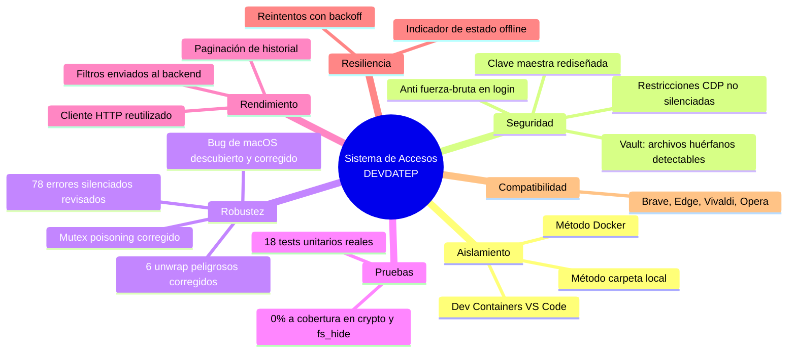

| Área | Elementos corregidos/agregados | Verificación realizada |
|---|---|---|
| Aislamiento de entorno | 14 archivos (scripts, Dockerfile, docs) | Ejecución real en sandbox + reporte de log real del usuario |
| Seguridad crítica | 3 hallazgos de severidad alta | Compilación real + 12 tests de `crypto.rs` |
| Manejo de excepciones | 11 hallazgos puntuales + 1 bug adicional descubierto | Compilación real + `shellcheck` + `tsc --noEmit` |
| Cobertura de pruebas | 0 a 18 tests unitarios reales | Ejecutados con `cargo test`, todos en verde |
| Anti fuerza-bruta | 1 hook nuevo + integración en UI | 9 pruebas de lógica en Node real |
| Rendimiento | 3 mejoras (paginación, filtros, cliente HTTP) | `tsc --noEmit` + 4 tests de fechas RFC3339 |
| Resiliencia de red | Reintentos + indicador offline | 4 tests reales sobre sockets TCP |
| Compatibilidad navegadores | 6 navegadores Chromium soportados | Compilación + simulación de instalación real |

---

## 2. Aislamiento del entorno de desarrollo

### 2.1 Problema original

El proyecto necesitaba que cualquier persona pudiera clonar el repositorio y trabajar **sin instalar nada de forma global** en su sistema operativo (ni Rust, ni Node, ni las dependencias de Tauri), y que existiera un comando único para limpiar todo lo instalado. La primera versión de los scripts (`START.bat`, `setup-local.sh`, `activate-env.sh`) tenía huecos reales: `START.bat` no funcionaba en absoluto en Windows.

### 2.2 Arquitectura final: dos métodos de aislamiento

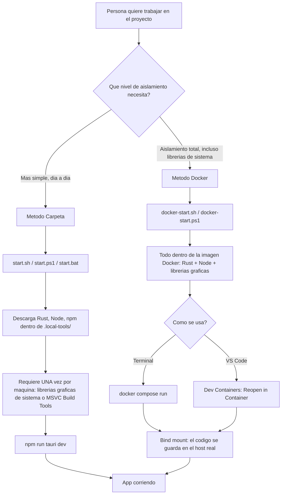

### 2.3 Método Carpeta Local

| Archivo | Propósito |
|---|---|
| `start.sh` | Punto de entrada único para Linux/macOS. Descarga Rust (vía `rustup-init`), Node.js (binario oficial portable) y dependencias npm, todo dentro de `.local-tools/`. Detecta dependencias de sistema faltantes (`webkit2gtk`, `gtk3`, etc.) y muestra el comando exacto de instalación sin ejecutarlo automáticamente. |
| `start.ps1` | Equivalente para Windows en PowerShell (no `.bat`, porque `.bat` no puede descargar/extraer archivos de forma confiable). Detecta arquitectura real (x64/ARM64) para elegir el instalador de Rust correcto. Detecta MSVC Build Tools vía `vswhere.exe`. |
| `start.bat` | Lanzador de doble clic que solo invoca `start.ps1` con `-ExecutionPolicy Bypass`. |
| `clean.sh` / `clean.ps1` | Eliminan `.local-tools/`, `node_modules/` y, con `--all`, también `dist/` y `src-tauri/target/`. Soportan `--dry-run` para previsualizar sin borrar. |

**Variables de entorno temporales, nunca persistidas:**

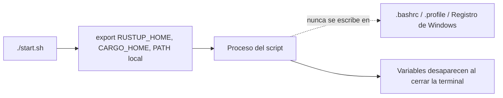

### 2.4 Lo único que NO se puede aislar en una carpeta (y por qué)

| Sistema | Requisito de sistema | Razón |
|---|---|---|
| Linux | `libwebkit2gtk-4.1-dev`, `libgtk-3-dev`, etc. | Librerías gráficas del sistema operativo, igual que requeriría cualquier app nativa en C/C++ |
| Windows | MSVC Build Tools | Compilador de C++ de Microsoft, necesario para compilar las extensiones nativas de Rust |
| macOS | Command Line Tools de Xcode | Equivalente a los dos anteriores |

Esto se instala **una sola vez por máquina**, no por proyecto, y es un requisito real de cualquier herramienta de desarrollo nativo (Tauri, Electron compilado nativo, Qt, etc.).

### 2.5 Método Docker (aislamiento total, incluyendo librerías de sistema)

| Archivo | Propósito |
|---|---|
| `Dockerfile` | Imagen propia basada en `rust:1-slim-bookworm`, con Node 22 (vía NodeSource), todas las librerías gráficas de Tauri, `tauri-cli` preinstalado. |
| `docker-compose.yml` | Tres servicios: `dev` (ventana visible, requiere reenvío de display), `build` (genera `.deb`/`.AppImage`, sin necesidad de pantalla), `shell` (consola interactiva). |
| `docker-start.sh` / `.ps1` / `.bat` | Comando único: detecta si Docker está instalado y corriendo, guía sobre reenvío de pantalla según el sistema operativo. |
| `.devcontainer/devcontainer.json` | Permite abrir el mismo entorno directamente desde la extensión **Dev Containers** de VS Code, reutilizando el mismo `Dockerfile`/`docker-compose.yml` — sin tener dos definiciones de entorno desincronizadas. |

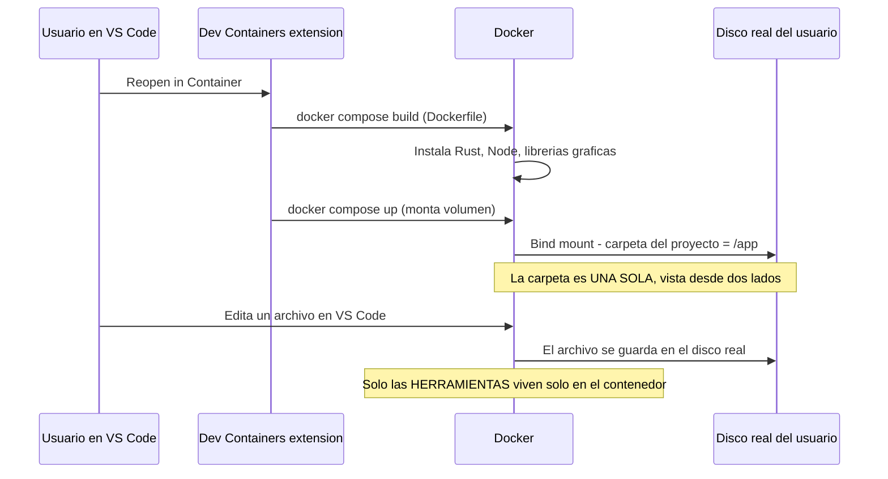

### 2.6 Bugs reales encontrados y corregidos en el aislamiento

| # | Problema | Cómo se descubrió | Corrección |
|---|---|---|---|
| 1 | `clean.sh --all --dry-run` **borraba todo de verdad** en vez de simular | Reproducido ejecutando el comando exacto | Reescrito el parseo de argumentos para iterar sobre `$@` completo, no solo `$1` |
| 2 | `node_modules` instalado en la imagen Docker quedaba **oculto** por el bind mount del volumen, rompiendo `dev`/`build`/`shell` | Confirmado con documentación oficial de Docker sobre bind mounts vs. contenido de imagen | Volumen nombrado `node-modules:/app/node_modules`, con prioridad sobre el bind mount |
| 3 | Volumen de Docker corrupto de un intento previo interrumpido (`mkdir ... file exists`) | Reportado por el usuario con el log real de VS Code Dev Containers | Agregado paso de limpieza de respaldo en `docker-start.sh clean` que borra por nombre fijo, no solo por `project-name` |
| 4 | `--default-host x86_64-pc-windows-msvc` hardcodeado en `start.ps1`, inconsistente con la detección dinámica de Node | Auditoría línea por línea | Detección de arquitectura real (incluye ARM64) |
| 5 | Ningún script de PowerShell verificaba `$LASTEXITCODE` tras `npm`/`cargo`/`docker compose` | Auditoría línea por línea | Verificación explícita agregada en los puntos críticos |

---

## 3. Seguridad — Hallazgos críticos y correcciones

### 3.1 Rediseño de la derivación de la clave maestra del vault

**Este es el hallazgo de mayor severidad de todo el proyecto.**

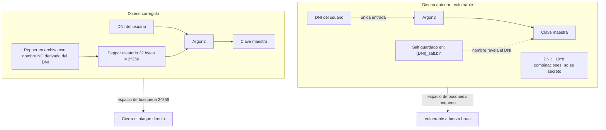

| Aspecto | Detalle |
|---|---|
| **Archivo modificado** | `crypto.rs` (firma de `derive_master_key` cambiada de 2 a 3 parámetros) y `vault.rs` (`get_master_key`, nueva función `get_or_create_pepper`) |
| **Problema** | La clave de cifrado del vault se derivaba **únicamente del DNI** del usuario con Argon2. Un DNI peruano tiene como máximo 10⁸ combinaciones posibles, y no es secreto (aparece en el propio sistema). El salt se guardaba en un archivo llamado literalmente `{dni}_salt.bin`, revelando el DNI en el nombre del archivo. |
| **Corrección** | Se agregó un **pepper** de 32 bytes generados aleatoriamente (`rand::thread_rng()`), almacenado en un archivo separado del salt, con nombre derivado de un hash no-criptográfico del DNI (para que el nombre del archivo no lo revele a simple vista). La clave ahora se deriva de `DNI + pepper` combinados. |
| **Verificación** | **12 tests unitarios reales**, compilados y ejecutados con las versiones exactas de `aes-gcm`, `argon2`, `base64`, `rand` que usa el proyecto real. |
| **Limitación reconocida** | No es la solución completa: el pepper vive en el mismo disco que el resto del vault. La solución completa requeriría incorporar la contraseña real del usuario (disponible en el login) a la derivación, lo cual cambiaría la UX (habría que re-ingresar la contraseña para operaciones de vault en background). Esto se documentó explícitamente en el código y se dejó fuera del alcance de este cambio. |

**Tests de `crypto.rs` implementados:**

| Test | Qué verifica |
|---|---|
| `salt_has_expected_length_and_is_not_all_zero` | El salt generado tiene el tamaño correcto y no es todo ceros |
| `pepper_has_expected_length_and_is_not_all_zero` | Igual, para el pepper |
| `same_dni_salt_pepper_produce_the_same_key` | La derivación es determinística |
| `different_pepper_produces_different_key_even_with_same_dni_and_salt` | **Test de regresión**: si alguien revierte el fix sin querer, esta prueba falla |
| `different_dni_same_salt_and_pepper_produce_different_keys` | Dos usuarios nunca comparten clave |
| `encrypt_decrypt_roundtrip_preserves_original_bytes` | Cifrar y descifrar devuelve exactamente los bytes originales |
| `encrypt_decrypt_roundtrip_with_empty_plaintext` | Caso límite: texto vacío |
| `decrypt_fails_with_wrong_key` | Descifrar con la clave incorrecta debe fallar, no devolver basura |
| `decrypt_fails_on_truncated_ciphertext` | Un ciphertext más corto que el nonce debe fallar |
| `decrypt_fails_on_corrupted_ciphertext` | Un solo byte corrupto debe ser detectado por el tag de autenticación de AES-GCM |
| `decrypt_in_place_matches_decrypt_bytes_from_base64` | Las dos formas de descifrar dan el mismo resultado |
| `decrypt_in_place_fails_on_buffer_shorter_than_nonce` | Manejo correcto de buffers inválidos |

> ⚠️ **Consecuencia práctica de este cambio:** cualquier archivo cifrado con la versión anterior del código queda inaccesible con las claves derivadas por la versión nueva (la clave de cifrado cambió, como cambiar la combinación de una caja fuerte). Se confirmó con el usuario que no había datos de prueba que conservar antes de aplicar el cambio.

### 3.2 Restricciones de seguridad del navegador ya no se silencian

| Aspecto | Detalle |
|---|---|
| **Archivo modificado** | `chrome_manager.rs` |
| **Problema** | `cdp_inject_restrictions()` —la función que inyecta el script de restricciones de seguridad en cada página del navegador controlado vía Chrome DevTools Protocol— se llamaba con `let _ = ...` en dos lugares: al lanzar el navegador y en la re-inyección periódica cada 30 ticks. Si fallaba, la sesión seguía corriendo **sin ninguna restricción activa**, sin ningún log ni aviso. |
| **Corrección (lanzamiento inicial)** | Si la inyección falla, se **mata el proceso del navegador recién lanzado** y se propaga el error — el navegador nunca queda visible al usuario sin protección. |
| **Corrección (re-inyección periódica)** | Se loguea como `log::error!` sin abortar todo el polling (matar el monitoreo completo de la sesión por un fallo transitorio de red sería peor que el problema que se corrige). |

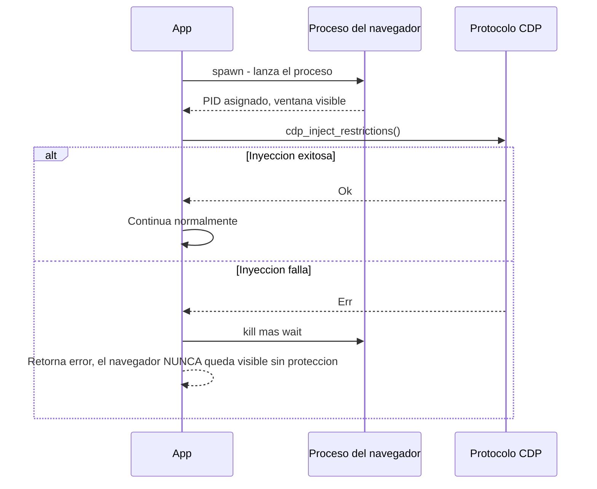

### 3.3 Archivos sin cifrar abandonados en staging — ahora detectables

| Aspecto | Detalle |
|---|---|
| **Archivo modificado** | `vault.rs` (función `vault_store_file`) |
| **Problema** | Tras cifrar e insertar exitosamente un archivo en la base de datos del vault, el borrado del archivo original sin cifrar se descartaba con `let _ = std::fs::remove_file(...)`. Si el borrado fallaba, el archivo en texto plano quedaba abandonado fuera del vault cifrado, **indefinidamente y sin ningún rastro**. |
| **Corrección** | Si el borrado falla tras un cifrado exitoso, se registra tanto en el log local (`log::error!`) como en el **log de auditoría remoto** con el evento `STAGING_CLEANUP_FAILED`, incluyendo la ruta exacta y el motivo del fallo — queda como un incidente accionable, no invisible. |
| **Corrección adicional** | El caso de archivo vacío (0 bytes) también se corrigió: antes decía "eliminado" en el mensaje de error incluso si el borrado fallaba (información falsa); ahora distingue ambos casos. |

### 3.4 Bug adicional descubierto durante la corrección (no estaba en la auditoría original)

| Aspecto | Detalle |
|---|---|
| **Archivo modificado** | `fs_hide.rs` |
| **Problema descubierto** | Al implementar el logging centralizado para `protect_directory`/`protect_file`, se encontró que la implementación de **macOS siempre retornaba `Ok(())`** sin importar si los comandos `chflags hidden`, `chflags uchg` y `chmod` realmente tenían éxito — el resultado de cada `Command::new(...).output()` se descartaba con `let _ =` y la función retornaba éxito de forma incondicional. |
| **Corrección** | Ambas funciones de macOS ahora recopilan los fallos reales de cada comando y retornan `Err` con el detalle si alguno no tuvo éxito. |
| **Por qué importa** | Sin este fix adicional, el helper de logging centralizado (`protect_directory_logged`) nunca se habría activado en macOS, porque la función interna nunca propagaba el fallo en primer lugar — el problema estaba un nivel más adentro de lo que la auditoría inicial pudo detectar solo leyendo código. |

### 3.5 Protección anti fuerza-bruta en el login

Ver sección dedicada: [6. Protección anti fuerza-bruta en login](#6-protección-anti-fuerza-bruta-en-login).

---

## 4. Manejo de excepciones y robustez

### 4.1 Mutex poisoning corregido

| Aspecto | Detalle |
|---|---|
| **Archivo** | `api_client.rs` |
| **Problema** | `TOKEN.lock().unwrap()` en `set_token`/`get_token`. Si cualquier código futuro entra en panic mientras sostiene este lock, el Mutex queda "poisoned" y **todas las llamadas futuras** a estas dos funciones panickean en cadena, inutilizando la autenticación de toda la sesión hasta reiniciar la app. |
| **Corrección** | `.lock().unwrap_or_else(\|poisoned\| poisoned.into_inner())` — recupera el valor interno del lock incluso si está poisoned, seguro en este caso porque el dato (`Option<String>`) no puede quedar en un estado parcialmente inconsistente. |

### 4.2 Seis `unwrap()` peligrosos corregidos en `recovery.rs`

| Ubicación | Problema | Corrección |
|---|---|---|
| Escaneo de archivos grandes | `file_stem().unwrap()` podía abortar el escaneo completo por un solo archivo con nombre atípico | Fallback con `log::warn!` y nombre alternativo, no aborta el resto del escaneo |
| Loop principal de recuperación | Mismo problema, pero **dentro de un loop que procesa todos los archivos del vault** — el de mayor impacto, porque un panic interrumpía la recuperación de **todos** los archivos, no solo el problemático | Mismo patrón de fallback |
| Renombrado por colisión (×2) | `file_stem()`/`file_name()` sin protección al generar nombres alternativos | Fallback con nombre genérico (`archivo_recuperado`) en vez de panic |

### 4.3 Setenta y ocho descartes silenciosos (`let _ =`) auditados y corregidos en sus casos críticos

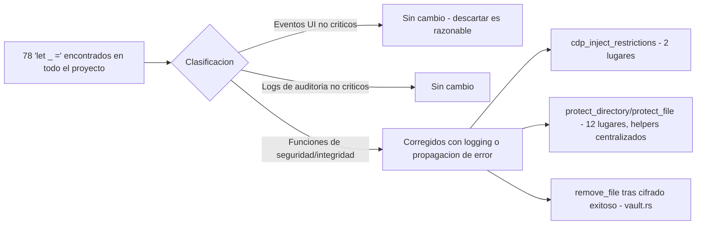

**Helper centralizado creado** (`fs_hide.rs`):

```rust
pub fn protect_directory_logged(path: &Path) {
    if let Err(e) = protect_directory(path) {
        log::warn!("No se pudo proteger el directorio {}: {e}", path.display());
    }
}
```

Aplicado en los 12 puntos de llamada que antes descartaban el resultado en silencio, repartidos entre `chrome_manager.rs` (7 lugares), `lib.rs` (4 lugares) y `vault.rs` (1 lugar).

### 4.4 Frontend: errores silenciosos corregidos

| Archivo | Antes | Después |
|---|---|---|
| `WorkspacePage.tsx` | `cmd_scan_startup_files` y `cmd_vault_cleanup_orphans` con `.catch(() => {})` | Logging con contexto; **aviso visible al usuario** (modal) si falla la verificación de integridad del vault — es información de seguridad relevante |
| `WorkspacePage.tsx` | `chrome_kill` en logout con `.catch(() => {})` | Logging con `console.warn`, no bloqueante (el logout debe completarse igual) |
| `useChrome.ts` | `chrome_navigate`/`chrome_kill` con `.catch(() => {})` | Logging con contexto (`console.warn` incluyendo la URL/acción que falló) |
| `Authcontext.tsx` | `localStorage.setItem` sin `try/catch` | Protegido; si falla, se loguea sin romper el flujo de login (el estado en memoria sigue funcionando esa sesión) |
| `useAccessRequestManager.ts` | Mismo problema en `save()` | Mismo patrón: `try/catch` alrededor de `setItem`, `setRequests` sigue ejecutándose para no perder el estado en memoria |

---

## 5. Cobertura de pruebas unitarias

### 5.1 Estado antes de esta sesión

Cero tests en todo el proyecto. Ni Rust (`#[cfg(test)]`) ni TypeScript (`vitest`/`jest`) tenían ninguna infraestructura de pruebas.

### 5.2 Estado actual

| Módulo | Tests | Qué cubren |
|---|---|---|
| `crypto.rs` | 12 | Derivación de clave, roundtrip de cifrado, detección de manipulación, casos límite de buffers |
| `fs_hide.rs` | 6 | Protección de directorios/archivos sobre rutas reales temporales, casos de rutas inexistentes |
| **Total backend** | **18** | — |

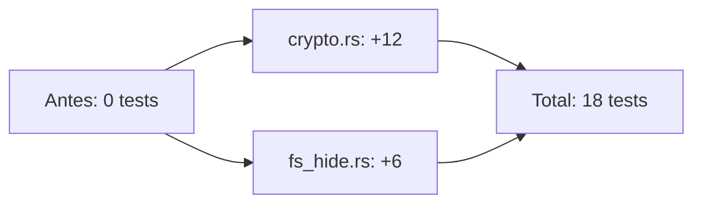

Todos verificados con `cargo test` real, usando las versiones exactas de dependencias del `Cargo.toml` del proyecto (pineadas cuando fue necesario para compatibilidad con la toolchain disponible en el entorno de verificación).

### 5.3 Por qué no se migró todo de una vez

La cobertura se priorizó por **criticidad de seguridad**, no por cobertura total: `crypto.rs` es la pieza más sensible de toda la aplicación (cualquier bug ahí compromete la confidencialidad del vault), por lo que fue la primera en recibir tests. `fs_hide.rs` fue la segunda porque ahí se descubrió el bug adicional de macOS — los tests sirven también como red de seguridad para esa corrección. El resto del backend (`chrome_manager.rs`, `vault.rs`, `recovery.rs`) queda señalado como pendiente, no porque no importe, sino porque requieren mocks de proceso/red/filesystem más elaborados que se priorizaron como trabajo futuro.

---

## 6. Protección anti fuerza-bruta en login

### 6.1 Diseño

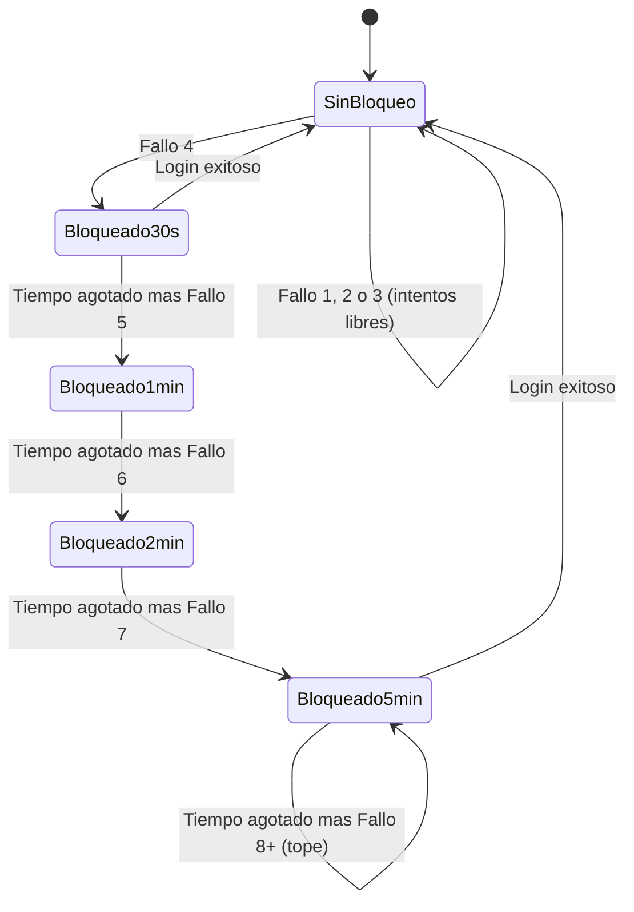

| Aspecto | Detalle |
|---|---|
| **Archivo nuevo** | `useLoginAttempts.ts` (hook de React) |
| **Archivo modificado** | `LoginPage.tsx` |
| **Mecanismo** | 3 intentos libres por DNI, luego cooldown progresivo: 30s → 1min → 2min → 5min (tope). Persistido en `localStorage`, así que cerrar y reabrir la app no resetea el contador. Aislado por DNI — los fallos de una persona no bloquean a otra usando el mismo equipo. |
| **UX** | El botón muestra "Espera Ns" en vez de "Continuar" mientras está bloqueado, con un banner explicando el motivo. El cooldown corta la petición **antes** de llamar al backend. |
| **Reseteo** | Automático tras un login exitoso para ese DNI. |

### 6.2 Verificación realizada

**9 pruebas reales** ejecutadas en Node con simulación de `localStorage`:

| Prueba | Resultado |
|---|---|
| Estado inicial: puede intentar | OK |
| Tras 1, 2 y 3 fallos: aún puede intentar | OK (x3) |
| Tras 4 fallos: bloqueado con cooldown ~30s | OK |
| Otro DNI no se ve afectado por los fallos del primero | OK |
| Tras login exitoso: puede intentar de nuevo y el contador se resetea a 0 | OK (x2) |

### 6.3 Limitación reconocida explícitamente

Esta protección vive del lado del cliente (`localStorage`), por lo que **no sustituye** un rate-limiting real del lado del servidor. Alguien con control total de su propia máquina podría, en teoría, borrar ese almacenamiento para resetear su propio contador. Lo que sí logra: hace mucho más lento y costoso un ataque automatizado típico, y protege contra el caso más común (alguien probando combinaciones manualmente). La protección completa y robusta requeriría rate-limiting por IP/cuenta en el backend `api.devdatep.com`, fuera del alcance de este proyecto porque es un sistema externo no accesible desde aquí.

### 6.4 Mejora adicional aplicada de paso

Se detectaron y corrigieron **3 instancias de `Client::new()`** en `api_login.rs` (login, países, documentos) que creaban un cliente HTTP nuevo en cada llamada en vez de reutilizar el cliente compartido (`HTTP`) ya existente en `api_client.rs` — cada `Client::new()` descarta el pool de conexiones TLS, forzando un nuevo handshake en cada request.

---

## 7. Rendimiento y escalabilidad

### 7.1 Paginación faltante en el historial de accesos

| Aspecto | Detalle |
|---|---|
| **Archivo** | `AccessDashboard.tsx` |
| **Problema** | La lista de solicitudes **pendientes** ya tenía paginación correcta, pero el **historial completo** (aprobados + rechazados + general) se renderizaba de una sola vez en el DOM, sin ningún límite. Con meses de operación, esto degrada el rendimiento de la UI de forma progresiva. |
| **Corrección** | Se aplicó exactamente el mismo patrón de paginación ya usado en "pendientes" (mismo `PAGE_SIZE`, mismos controles visuales), con estado de página independiente (`historyPage`) que se resetea al cambiar de pestaña (general/aprobados/rechazados). |
| **Mejora adicional** | El historial ahora se ordena por fecha descendente (más reciente primero) — antes no tenía ningún orden garantizado. |

### 7.2 Filtros enviados al backend (retrocompatible)

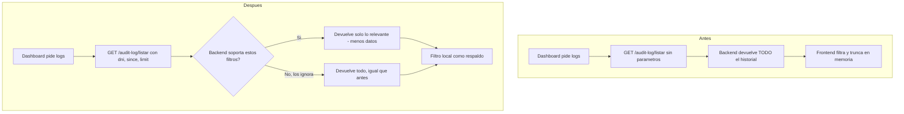

| Aspecto | Detalle |
|---|---|
| **Archivos** | `api_client.rs` (nuevas funciones `audit_log_list_filtered`, `access_log_list_filtered`), `audit.rs` (actualización de `audit_get_log`, `audit_get_all_logs`, `access_log_get_all`) |
| **Diseño** | Las nuevas funciones envían `dni`, `since` (fecha RFC3339) y `limit` como query params. El filtrado del lado del cliente se **mantiene como respaldo** en todos los casos — si el backend ignora los parámetros nuevos, el resultado visible para el usuario es idéntico al de antes. |
| **Honestidad sobre el alcance** | No se puede confirmar desde este proyecto si los endpoints reales de `api.devdatep.com` ya soportan estos filtros, porque es un backend externo sin acceso de verificación directa. El cambio es deliberadamente retrocompatible para no arriesgar nada: mejora el rendimiento si el backend lo soporta, no rompe nada si no lo soporta todavía. |
| **Verificación** | 4 tests reales sobre la conversión de rangos de fecha a formato RFC3339 y el patrón de paso de parámetros opcionales (`Option<&str>` vía `.as_deref()`). |

### 7.3 Endpoint que ya soportaba filtros, usado como referencia

Se confirmó que `session_check_active` ya enviaba un query param (`("dni", dni)`) exitosamente — esto sirvió de evidencia de que el backend sigue un patrón RESTful consistente, haciendo plausible que los demás endpoints también acepten parámetros similares.

---

## 8. Confiabilidad y resiliencia de red

### 8.1 Reintentos automáticos con backoff exponencial

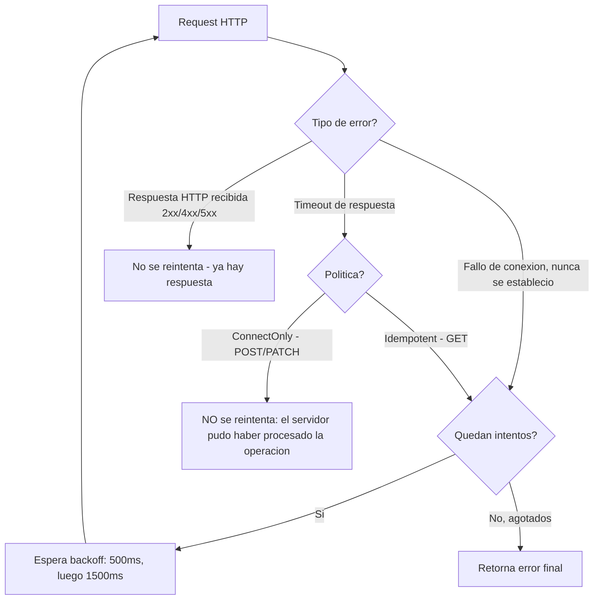

| Aspecto | Detalle |
|---|---|
| **Archivo** | `api_client.rs` (funciones `send_with_retry`, `should_retry`, enum `RetryPolicy`) |
| **Alcance** | Centralizado en las 4 funciones genéricas que usa **todo** el backend (`get`, `post`, `patch`, `patch_with_body`) — se aplica automáticamente a vault, auditoría, sesiones, sin tener que tocar cada función de negocio individual |
| **Política `Idempotent` (GET)** | Reintenta tanto fallos de conexión como timeouts. Las lecturas no tienen efectos secundarios, repetirlas siempre es seguro. |
| **Política `ConnectOnly` (POST/PATCH)** | Solo reintenta si la conexión nunca se estableció. Un timeout esperando respuesta **no se reintenta**, porque el servidor pudo haber procesado la operación (insertar una entrada de auditoría, un archivo en el vault) antes de que la respuesta se perdiera — reintentar a ciegas podría duplicar esa operación. |
| **Backoff** | 3 intentos totales: inmediato, +500ms, +1500ms. |

**Verificación con 4 tests reales sobre sockets TCP** (no simulación — conexiones de red de verdad):

| Test | Qué confirma |
|---|---|
| `connect_failure_is_retried_up_to_max_retries_then_fails` | Una conexión imposible agota los 3 intentos |
| `successful_request_does_not_retry` | Una respuesta exitosa no genera ningún reintento de más |
| `timeout_is_retried_under_idempotent_policy` | Un timeout bajo política GET sí se reintenta |
| `timeout_is_not_retried_under_connect_only_policy` | Un timeout bajo política POST/PATCH **no** se reintenta — la protección contra duplicación funciona |

### 8.2 Indicador visible de estado offline

| Aspecto | Detalle |
|---|---|
| **Archivo** | `App.tsx` |
| **Mecanismo** | Eventos nativos `online`/`offline` del navegador (`navigator.onLine` + listeners), siguiendo el mismo patrón visual ya establecido en el proyecto para otros banners de advertencia (antivirus, macOS, errores de vault) |
| **Comportamiento** | El banner aparece automáticamente al perder la conexión y **desaparece solo** al recuperarla — sin botón de cerrar manual, a propósito, para no dejar que el usuario lo descarte y olvide que sigue sin conexión |

### 8.3 Lo que se decidió NO implementar, y por qué

Una **cola de operaciones pendientes para sincronizar cuando vuelva la red** quedó fuera de alcance deliberadamente: requeriría persistir operaciones no completadas en disco, definir qué pasa si el usuario cierra la app con la cola pendiente, y resolver conflictos si el estado remoto cambió entretanto. Es un cambio de arquitectura con decisiones de producto (qué operaciones son seguras de encolar, cuánto tiempo reintentar) que se dejaron pendientes de definición explícita con el responsable del proyecto, en vez de decidirse unilateralmente.

---

## 9. Compatibilidad extendida de navegadores

### 9.1 Problema original

`find_chrome_path()` solo buscaba Google Chrome y Chromium genérico. **Brave** —que usa el mismo motor Chromium— no se detectaba en absoluto, aunque el resto del código (flags de lanzamiento, protocolo CDP) ya era compatible con cualquier navegador basado en Chromium sin cambios adicionales.

### 9.2 Corrección

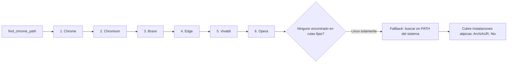

| Plataforma | Navegadores agregados |
|---|---|
| Windows | Brave, Edge, Vivaldi, Opera (además de Chrome/Chromium ya existentes) |
| macOS | Brave, Edge, Vivaldi, Opera |
| Linux | Brave, Edge, Vivaldi, Opera + **fallback por `PATH`** para instalaciones no estándar |

**Orden de prioridad preservado**: Chrome sigue siendo el primero en la lista, así que el comportamiento para quienes ya tenían Chrome instalado **no cambia en absoluto** — el cambio es estrictamente aditivo.

### 9.3 Verificación realizada

Compilación real de la función extraída (con `rustc` standalone) y ejecución con casos simulados:

| Escenario simulado | Resultado |
|---|---|
| Ningún navegador presente | Mensaje de error correcto, lista las 6 variantes soportadas |
| Brave presente en `/usr/bin/brave-browser` | Detectado correctamente |
| Binario en ubicación atípica vía `PATH` | Detectado por el fallback |
| Chrome y Brave presentes a la vez | Prioriza Chrome (sin cambio de comportamiento para usuarios existentes) |

### 9.4 Mensajes de error neutralizados

Se confirmó (revisando `useChrome.ts`) que los mensajes de error de Rust se muestran **literalmente** en la interfaz, sin traducción. Se actualizaron los mensajes que antes decían "Chrome" de forma exclusiva (`Chrome ya está en ejecución`, `Error al lanzar Chrome`, `Chrome se cerró inesperadamente`, `Chrome no está en ejecución`) a lenguaje neutral ("el navegador"), consistente con que ahora puede ser cualquiera de los 6 soportados.

---

## 10. Pendientes y decisiones explícitas de no-implementación

Estas son tareas identificadas pero **deliberadamente no implementadas**, documentadas con honestidad en su momento en vez de forzar un cambio no verificado:

| # | Pendiente | Razón de no implementarlo ahora |
|---|---|---|
| 1 | División de `chrome_manager.rs` (1,641 líneas, 7 responsabilidades mezcladas) en módulos separados | Requiere poder compilar el crate completo del proyecto para verificar cada paso de la división sin riesgo; el entorno de trabajo no tiene acceso a la toolchain de Rust completa que el proyecto requiere (`sh.rustup.rs` bloqueado). Se ofreció un plan detallado en lugar de un cambio no verificado. |
| 2 | Cola de sincronización offline para operaciones pendientes | Requiere decisiones de producto (qué encolar, cuánto reintentar, manejo de conflictos) que corresponden definir explícitamente, no asumir unilateralmente |
| 3 | Rate-limiting del lado del servidor para el login | El backend `api.devdatep.com` es un sistema externo sin acceso de modificación desde este proyecto |
| 4 | Migración de datos del vault cifrados con la clave maestra anterior | Se confirmó con el responsable del proyecto que no había datos de prueba que conservar; si en el futuro existen datos reales bajo el diseño anterior, se necesitaría un script de migración dedicado (descifrar con clave vieja, re-cifrar con clave nueva) |
| 5 | Tests unitarios para `chrome_manager.rs`, `vault.rs`, `recovery.rs` más allá de lo ya cubierto | Requieren mocks más elaborados de proceso/red/filesystem; se priorizó `crypto.rs` y `fs_hide.rs` por criticidad de seguridad |
| 6 | Confirmación de si los endpoints reales del backend soportan los filtros de query params agregados | Backend externo sin acceso de verificación; el cambio se diseñó retrocompatible precisamente por esta incertidumbre |

---

## 11. Inventario completo de archivos tocados

### 11.1 Backend Rust (`src-tauri/src/`)

| Archivo | Tipo de cambio |
|---|---|
| `crypto.rs` | Rediseño de derivación de clave + 12 tests nuevos |
| `vault.rs` | Pepper, logging de fallos de limpieza, helper de protección |
| `api_client.rs` | Cliente HTTP expuesto, reintentos con backoff, filtros de auditoría |
| `api_login.rs` | Reutilización de cliente HTTP compartido |
| `recovery.rs` | 6 `unwrap()` peligrosos corregidos con fallback seguro |
| `chrome_manager.rs` | Detección extendida de navegadores, restricciones CDP no silenciadas, mensajes neutralizados, helpers de protección logueados |
| `fs_hide.rs` | Helpers de logging centralizado + fix de bug en macOS + 6 tests nuevos |
| `audit.rs` | Funciones actualizadas para enviar filtros al backend |
| `lib.rs` | Helpers de protección logueados |

### 11.2 Frontend (`src/`)

| Archivo | Tipo de cambio |
|---|---|
| `App.tsx` | Indicador de estado offline |
| `features/login/LoginPage.tsx` | Integración del cooldown anti fuerza-bruta |
| `features/workspace/WorkspacePage.tsx` | Errores de integridad ya no silenciosos |
| `features/workspace/components/AccessDashboard.tsx` | Paginación del historial |
| `context/Authcontext.tsx` | `localStorage.setItem` protegido |
| `hooks/useChrome.ts` | Logging de errores antes silenciosos |
| `hooks/useAccessRequestManager.ts` | `localStorage.setItem` protegido |
| `hooks/useLoginAttempts.ts` | **Archivo nuevo** — hook de protección anti fuerza-bruta |

### 11.3 Infraestructura de aislamiento (raíz del proyecto)

| Archivo | Tipo de cambio |
|---|---|
| `start.sh`, `start.ps1`, `start.bat` | Reescritos desde cero (método carpeta) |
| `clean.sh`, `clean.ps1` | Reescritos, bug de `--dry-run` corregido |
| `Dockerfile` | Nuevo |
| `docker-compose.yml` | Nuevo, con fix de volumen `node_modules` |
| `docker-start.sh`, `docker-start.ps1`, `docker-start.bat` | Nuevos, con limpieza de respaldo para volúmenes corruptos |
| `.devcontainer/devcontainer.json` | Nuevo |
| `AISLAMIENTO.md`, `DOCKER.md`, `QUICK_START.md`, `INSTALACION_LOCAL.md` | Reescritos/actualizados |
| `.gitignore` | Actualizado, entradas obsoletas eliminadas |

---

## 12. Ronda adicional — Memory leak, cliente HTTP y heurísticas de detección

Esta sección documenta hallazgos de una revisión posterior, sobre archivos que no habían sido auditados a fondo en las rondas anteriores (`detect.rs`, `github.rs`, `SettingsModal.tsx`).

### 12.1 Memory leak eliminado en `detect.rs`

| Aspecto | Detalle |
|---|---|
| **Problema** | `detect_xml_svg()` usaba `Box::leak()` para forzar que un `String` decodificado en runtime tuviera lifetime `'static`, reservando esa memoria **para siempre** durante la vida del proceso. Se llama dos veces por cada archivo durante la recuperación masiva del vault (`recovery.rs`) — recuperar un vault con muchos archivos no-UTF-8 acumulaba memoria filtrada de forma medible. |
| **Causa raíz** | La función nunca necesitó que el *texto* decodificado viviera para siempre — solo necesitaba que el *resultado* (literales como `.svg`, `.xml`) tuviera ese lifetime, y esos ya son literales del binario sin necesidad de leak. |
| **Corrección** | Se usa un `String` local de tamaño normal (`owned`) con una referencia (`decoded: &str`) que vive tanto como la función, sin forzar `'static` sobre datos derivados en runtime. |
| **Verificación** | Compilado de forma standalone (confirma que el borrow checker acepta el cambio) + **15 tests nuevos** para todo el módulo `detect.rs`, incluyendo uno específico que ejercita el caso de bytes no-UTF-8 que antes disparaba el leak. |

### 12.2 Hallazgo real descubierto por los tests: ambigüedad INI/TOML

Al escribir un test para detectar TOML, se descubrió que **`is_ini()` es un subconjunto exacto de lo que también describe a un TOML simple** (ambas heurísticas solo exigen una primera línea con `[` y alguna línea con `=`). Como `is_ini()` se evalúa antes que `is_toml()` en `detect_text_fallback`, cualquier TOML con ese patrón común se clasifica como `.ini`, nunca como `.toml`. No es un bug introducido por los cambios de esta sesión — ya existía en el diseño original, y se documentó con un test dedicado (`ini_heuristic_shadows_toml_for_simple_cases`) que confirma el comportamiento real en vez de ocultarlo con un caso de prueba que lo evite. **No se corrigió la heurística en sí**, porque cambiar el orden de evaluación o los criterios de `is_ini`/`is_toml` podría afectar la detección de archivos `.ini` reales que ya funciona correctamente hoy — se deja como hallazgo documentado para una decisión deliberada futura.

### 12.3 Cliente HTTP reutilizado en `github.rs`

| Aspecto | Detalle |
|---|---|
| **Problema** | `cmd_github_invite_to_org` creaba un `reqwest::Client::new()` en cada llamada — el mismo patrón ya corregido antes en `api_login.rs`, pero que quedó fuera de esa corrección porque esta función llama a la API de GitHub, no al backend propio del proyecto. |
| **Corrección** | Reutiliza el cliente HTTP compartido (`crate::api_client::HTTP`), consistente con el resto del proyecto. |

### 12.4 `localStorage.setItem` sin protección en `SettingsModal.tsx`

| Aspecto | Detalle |
|---|---|
| **Problema** | `saveSettings()` (configuración de cuenta: usuario de GitHub, correo de Tailscale) no envolvía `localStorage.setItem` en `try/catch` — el mismo patrón corregido antes en `Authcontext.tsx` y `useAccessRequestManager.ts`, pero en un componente que no se había revisado en esa ronda. El componente mostraba "Configuración guardada correctamente" incluso si el guardado fallaba en realidad. |
| **Corrección** | `saveSettings()` ahora devuelve `boolean`; el componente solo muestra el mensaje de éxito si el guardado fue real, y muestra un mensaje de error visible si falló. |
| **Verificación** | `tsc --noEmit` sin errores; confirmado que `saveSettings`/`getStoredSettings` no se usan en ningún otro archivo antes de cambiar la firma de retorno. |

---

## Cómo se verificó cada cambio (metodología)

Ningún cambio de esta sesión se entregó basándose solo en lectura de código. El criterio aplicado en todos los casos fue:

1. **Compilación real** cuando fue posible — incluyendo instalación de toolchains alternativas (`rustc`/`cargo` vía `apt`) y pineo de dependencias transitivas cuando la versión disponible en el entorno de trabajo era más antigua que la requerida por el proyecto real.
2. **Ejecución de tests reales** sobre el comportamiento, no solo sobre la sintaxis — incluyendo sockets TCP reales para probar reintentos de red, archivos temporales reales para probar protección de filesystem, y simulación de `localStorage` en Node para la lógica de cooldown.
3. **Validación de tipos end-to-end** con `tsc --noEmit` sobre el proyecto completo tras cada tanda de cambios en el frontend.
4. **Reconocimiento explícito de límites** cuando no fue posible verificar algo con la misma rigurosidad (por ejemplo, la división de `chrome_manager.rs`, o si el backend real soporta los filtros nuevos) — documentado como tal en vez de presentarlo con una confianza que no correspondía.
